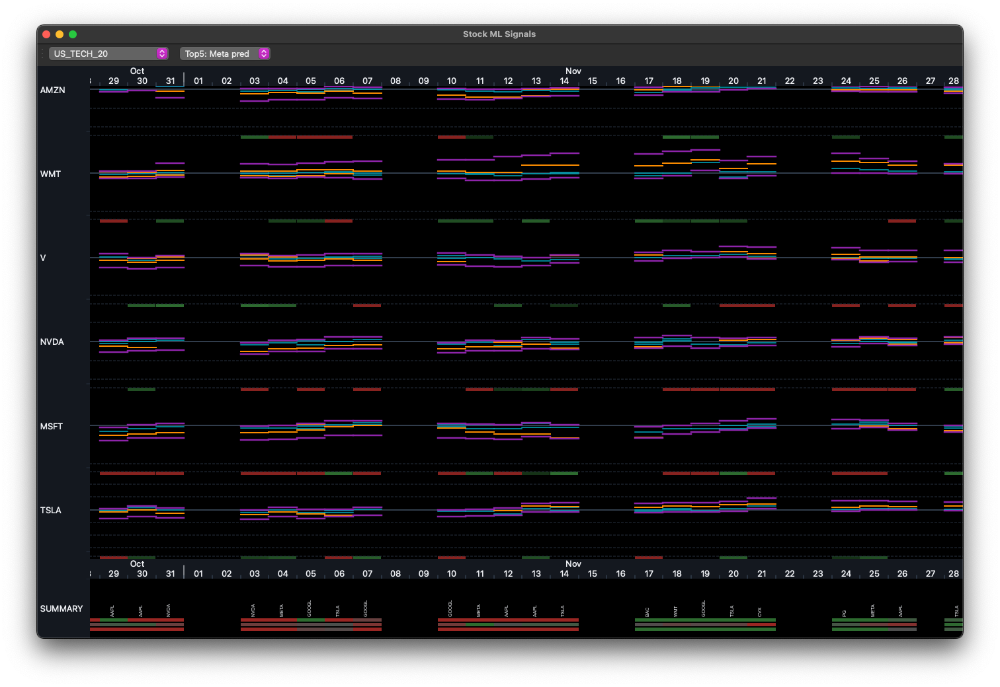
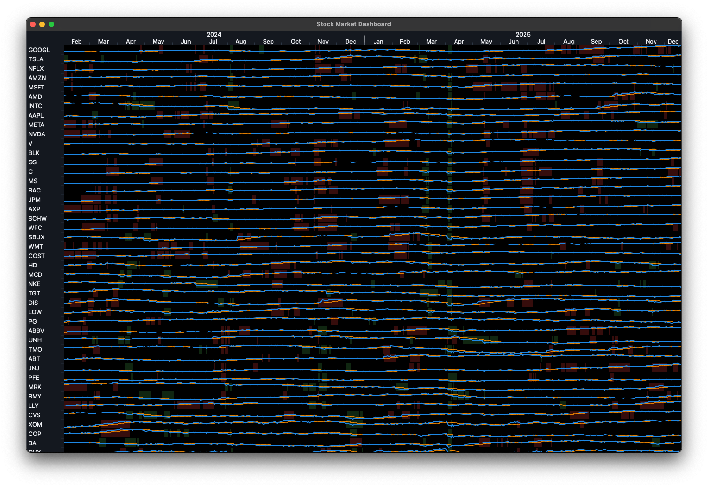
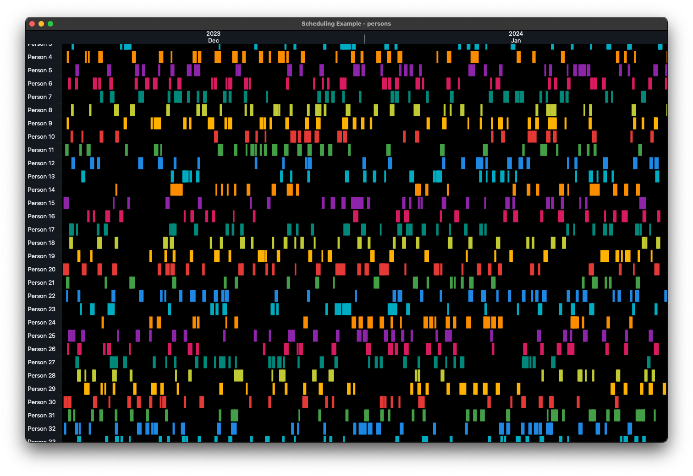
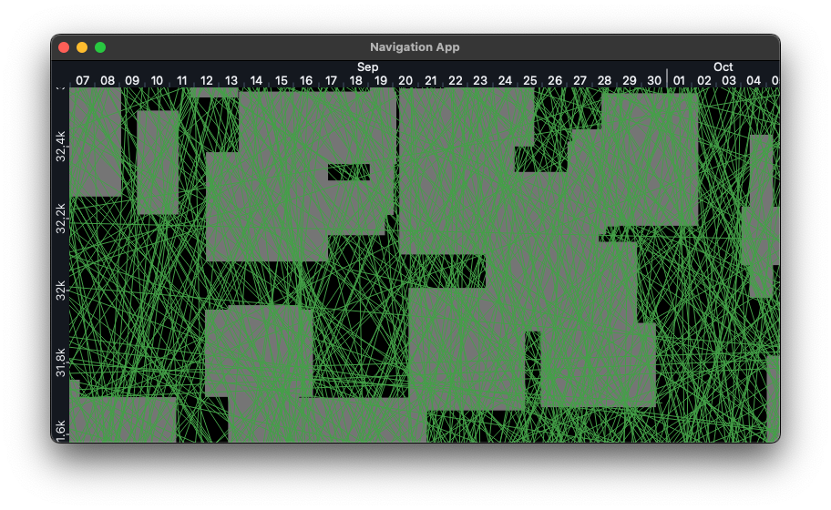

# Sprintify Navigation

A navigation widget for PySide6 that handles large datasets efficiently. Built for interactive time-series visualization, Gantt charts, stock data, heatmaps - anything that needs smooth pan/zoom.
<!-- HERO IMAGE: Shows the most impressive view (e.g. the stock app or gantt) -->
<p align="center">
  
</p>
## What it does

- A toolbox to build specialized interactive navigation UIs
- Easy to understand for AIs and humans
- Built for time-series, Gantt charts, stock data, heatmaps, scatter plots, and more
- Smooth pan/zoom with mouse wheel and drag
- Renders only visible data (handles millions of points)
- Dark/light mode through ColorMap
- Mouse wheel pan/zoom, click-drag pan
- Simple drawing API for rects, lines, text, or custom QPainter


## Get started

```sh
pip install sprintify-navigation
```

Basic usage:

```python
from sprintify.navigation import NavigationWidget, ColorMap, TimelineRuler, NumberRuler
from PySide6.QtWidgets import QMainWindow, QApplication
from PySide6.QtGui import QBrush, QPen
from datetime import datetime, timedelta

class MyWindow(QMainWindow):
    def __init__(self):
        super().__init__()
        self.color_map = ColorMap(darkmode=True)
        
        # Setup rulers
        self.h_ruler = TimelineRuler(datetime(2024, 1, 1), datetime(2024, 12, 31))
        self.v_ruler = NumberRuler(0, 100, reverse=True)
        
        # Create widget
        self.widget = NavigationWidget(self.h_ruler, self.v_ruler, self.color_map)
        self.setCentralWidget(self.widget)
        
        # Draw stuff
        blue = self.color_map.get_saturated_color("blue", "fill")
        self.widget.draw_rects(
            "my_rects",
            lambda: [
                (datetime(2024, 3, 1), 20, timedelta(days=30), 15),
                (datetime(2024, 6, 1), 50, timedelta(days=45), 20),
            ],
            brush=QBrush(blue)
        )

if __name__ == "__main__":
    app = QApplication([])
    window = MyWindow()
    window.show()
    app.exec()
```

## Examples

Check the `examples/` folder for complete working apps:

### Stock App
<!-- specific screenshot for this example -->


**stock_app.py** - Real stock data via yfinance.

### Scheduling App


**scheduling_app.py** - Employee shifts (200 people, ItemRuler usage).

### Navigation App


**navigation_app.py** - Random lines and Squares


## Rulers

### TimelineRuler
Date/time on horizontal axis. Auto-formats years/months/days/hours depending on zoom.

```python
ruler = TimelineRuler(datetime(2024, 1, 1), datetime(2024, 12, 31))
```

### NumberRuler
Numeric axis with SI units (k, M, G, etc). Can reverse for top-to-bottom.

```python
ruler = NumberRuler(0, 10000, reverse=False)
```

### ItemRuler
Categorical data - one band per item (employees, stocks, products, etc).

```python
ruler = ItemRuler(
    item_count=100,
    default_pixels_per_item=40,
    min_pixels_per_item=20,
    max_pixels_per_item=150
)
```

## Drawing

### Rectangles
```python
widget.draw_rects("layer_name", get_rects_func, brush=QBrush(color), pen=QPen(border))
# get_rects_func returns [(x, y, width, height), ...]
```

### Lines
```python
widget.draw_lines("layer_name", get_lines_func, pen=QPen(color, width))
# get_lines_func returns [(x1, y1, x2, y2), ...]
```

### Text
```python
widget.draw_texts("layer_name", get_texts_func, pen=QPen(color), font=QFont("Arial", 12))
# get_texts_func returns [(text, x, y), ...]
```

### Custom drawing
```python
def my_draw(painter):
    painter.setPen(QPen(Qt.red, 2))
    painter.drawEllipse(x, y, w, h)

widget.add_draw_command("custom", my_draw)
```

## Colors

ColorMap handles theming:

```python
color_map = ColorMap(darkmode=True)

# UI colors
bg = color_map.get_object_color("surface-base")
border = color_map.get_object_color("border")
text = color_map.get_object_color("text-base")

# Data viz colors
red = color_map.get_saturated_color("red", "fill")
blue = color_map.get_saturated_color("blue", "border")
```

Available: `red`, `green`, `blue`, `cyan`, `orange`, `purple`, `pink`, `teal`, `lime`, `amber`, `grey`

## Controls

- **Wheel**: Pan horizontal/vertical
- **Ctrl+Wheel**: Zoom at mouse position
- **Alt+Wheel**: Zoom vertical axis (NumberRuler only)
- **Click+Drag**: Pan both axes

## Performance tips

Only fetch visible data:

```python
def get_visible_rects():
    start = self.h_ruler.visible_start
    end = self.h_ruler.visible_stop
    
    return [
        (x, y, w, h) 
        for x, y, w, h in all_data 
        if x + w >= start and x <= end
    ]

widget.draw_rects("rects", get_visible_rects, brush=QBrush(color))
```

## Custom labels

```python
ruler = ItemRuler(item_count=50)
widget = NavigationWidget(h_ruler, ruler, color_map)
widget.left_ruler_widget.get_label = lambda i: f"Employee {i+1}"
```

## Ruler combinations

Mix rulers for different visualizations:

```python
# Gantt chart
NavigationWidget(TimelineRuler(...), ItemRuler(...), color_map)

# Stock chart
NavigationWidget(TimelineRuler(...), NumberRuler(...), color_map)

# Correlation matrix
NavigationWidget(ItemRuler(...), ItemRuler(...), color_map)

# Scatter plot
NavigationWidget(NumberRuler(...), NumberRuler(...), color_map)
```

## Architecture

Simple model-view split:

- **Rulers**: Handle coordinate transforms, zoom, pan math
- **RulerWidgets**: Render ticks/labels, handle mouse events
- **DrawingWidget**: Canvas for data visualization
- **NavigationWidget**: Composite putting it all together

## Requirements

- Python 3.8+
- PySide6
- yfinance (optional, only for stock example)

## License

MIT
